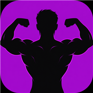
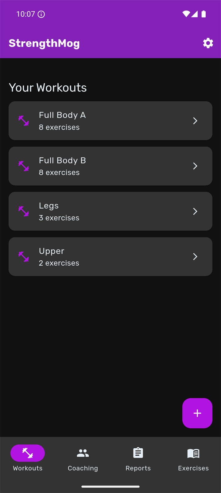
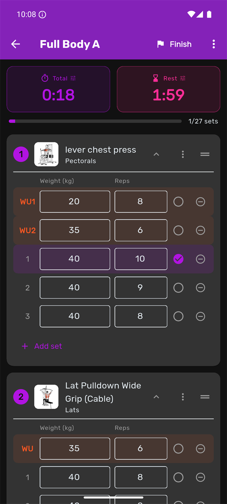
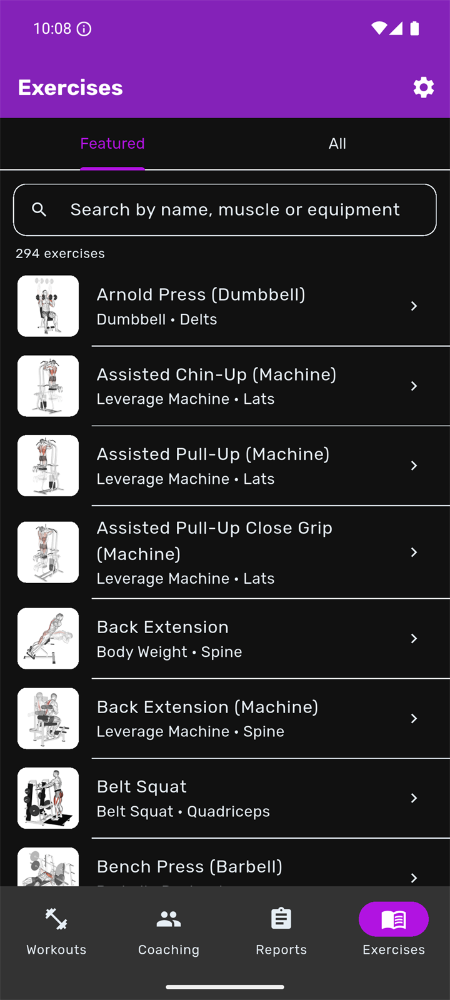
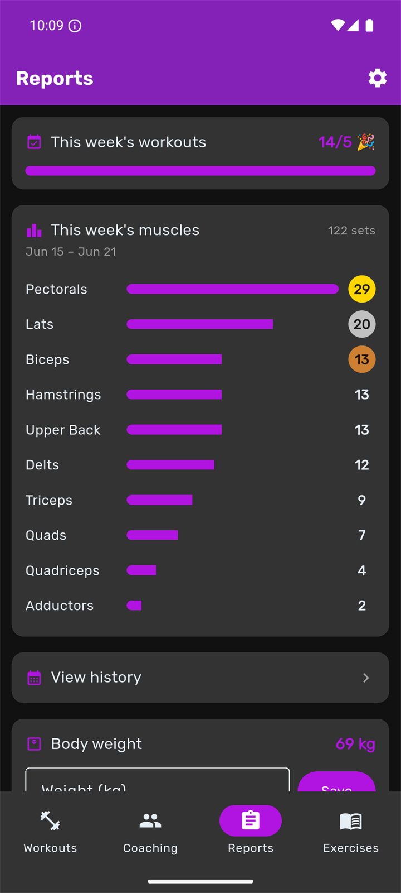
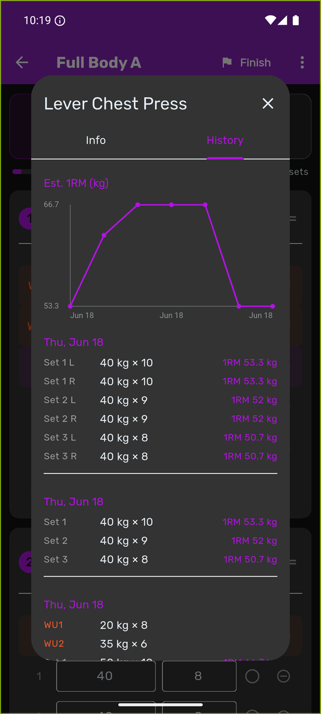
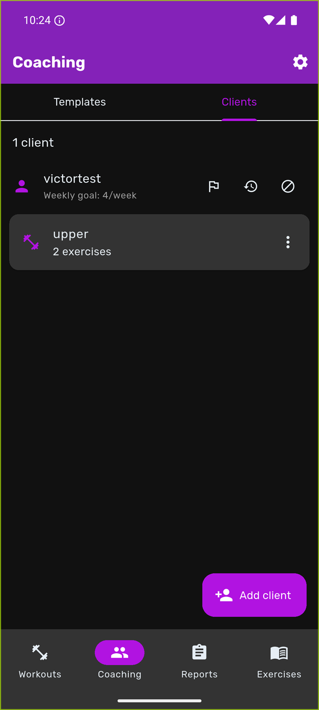
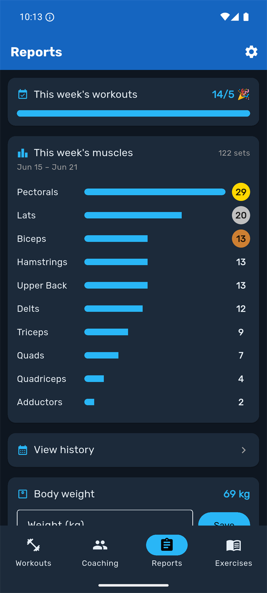
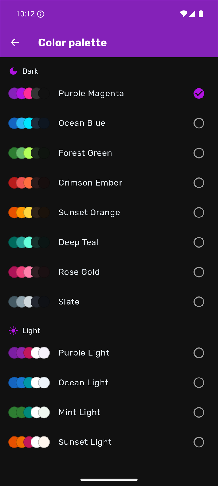
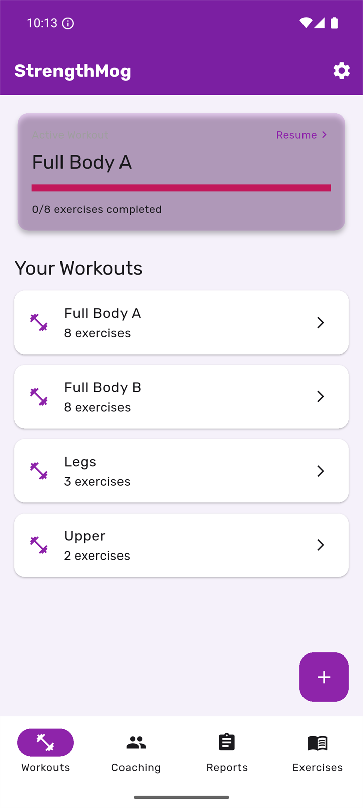

# StrengthMog

### Strength training built for coaches and the clients they train.

Coaches build workouts, assign them per client, and follow every session.
Clients get a fast, focused app to actually train with — live sessions, rest
timers, history, and progress charts. One offline catalog of **~1500 exercises**,
in **English and Spanish**.

**[⬇️ Download the latest release →](../../releases/latest)**

---

## 📲 Download & install

This repository hosts the official Android builds. Grab one from the
**[latest release](../../releases/latest)**:

| Build | Size | Who it's for |
|-------|------|--------------|
| **`StrengthMog-arm64.apk`** | ~31 MB | **Almost everyone** — phones from ~2017 onward (arm64-v8a) |
| `StrengthMog-universal.apk` | ~86 MB | Older 32-bit or non-standard devices; installs on anything |

**Installing the APK** (sideload):

1. Download the APK to your Android phone.
2. Open it — Android will ask to allow installing from this source the first
   time. Enable **“Install unknown apps”** for your browser/files app.
3. Tap **Install**, then open StrengthMog and sign in with the ID your coach
   gave you.

> 🔒 StrengthMog is invite-based. You sign in with an ID created by your coach —
> see [Getting an account](#-getting-an-account).

---

## ✨ A quick look

  
  
  
  

  
  

---

## 💪 What's inside

**For coaches**
- A reusable **template library** — build once, assign to many.
- Create accounts for your clients and **assign workouts per person**.
- Review each client's **logs, weekly volume, full history, and body weight**.
- Set **weekly workout goals** and see who's on track.

**For clients**
- Get your coach's workouts and train with a dedicated **live-session screen**.
- An auto-starting **rest timer** with haptics; adjust it on the fly.
- Everything **logs automatically** — sets, reps, weight, and estimated 1RM.

**In the app**
- **Workout building** — drag to reorder, warm-up sets, decimal weights,
  per-exercise rest, and coaching notes that travel with an assigned workout.
- **Progress & reports** — weekly workout tracker, a weekly muscle ranking with
  medals, per-set estimated 1RM, and per-exercise progression charts.
- **History at a glance** — a month calendar and a GitHub-style year heatmap.
- **~1500-exercise catalog** — bundled offline (EN/ES) with animated demos,
  equipment + muscle breakdowns, and step-by-step instructions.
- **Make it yours** — 8 dark and 4 light themes plus a choice of fonts, applied
  instantly across the whole app, fully localized in English and Spanish.

  
  
  

---

## 🎟️ Getting an account

StrengthMog is a **subscription for coaches** — each coach gets an account and
provisions their own clients. **Clients don't pay**; they access the app through
their coach.

Interested in coaching your clients with StrengthMog?
📧 **[elvsbyt@live.com](mailto:elvsbyt@live.com?subject=StrengthMog%20coaching%20subscription)**

---

## 📄 License

StrengthMog is **proprietary software** — © 2026 Víctor Segura, all rights
reserved. The binaries here are provided only so authorized users can install
the app. No rights to the source code are granted. See [LICENSE](LICENSE).
